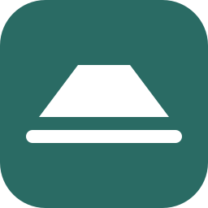
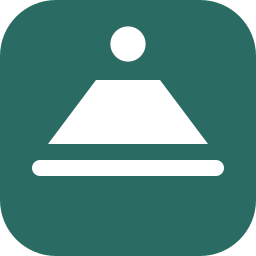
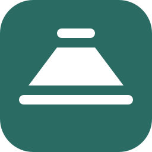

<p>
  <picture>
    <source media="(prefers-color-scheme: dark)" srcset="assets/dark_logo.svg">
    
  </picture>
</p>

# firmfooting brand

The mark is a **footing**: the wide pad you pour first, drawn as a trapezoid on a ground line that runs past it on both sides. It stands for what the tools promise, which is firm ground under you, so a wrong step never becomes a fall.

Everything here is generated by [`generate.py`](generate.py) from one set of numbers. Change the geometry or the palette there, run it, and commit the result. Never edit an SVG or PNG by hand; CI fails if a generated file no longer matches the script.

## The mark


The mark is drawn on a **16-unit grid**, the favicon's own pixel grid. Every horizontal edge sits on a whole unit, so at 16, 32 and 48 px the flat edges land exactly on pixels and only the two slopes are anti-aliased.

| Part | Geometry (grid units) |
|---|---|
| Tile | 16 × 16, corner radius 3.5, `brand` teal |
| Footing | trapezoid, 4 wide on top and 10 at the base, 4 tall, from y 5 to 9 |
| Gap | 1 unit |
| Ground line | 12 wide and 1 tall, from y 10 to 11, round ends. It runs 1 unit past the footing on each side, so the footing reads as standing on ground and not as a lamp on a base. |

The footing and ground line together are 12 × 6 and centred in the tile.

**Lockup.** The wordmark stands on the same ground as the footing: its baseline is the bottom of the ground line. It is set in Barlow SemiBold at 13.5 units, tracked −1 %, five units from the tile.

**Clear space.** Keep 2 units (an eighth of the tile's height) clear around the tile, and the tile's own height clear around the lockup.

**Minimum size.** The tile works down to 16 px. Below 120 px wide, use the tile on its own instead of the lockup.

**Variants.** A variant adds one element above the footing, on the same grid. They are for the two repositories that grew out of dbml-sharepoint:

| | Variant | Addition |
|---|---|---|
|  | `repos/dbml-sharepoint` | none; the canonical mark |
|  | `repos/dbml-sharepoint-probes` | a probe beacon: the validation agent |
|  | `repos/dbml-sharepoint-family` | a cover, 4 units wide: the private family copy |

Other tools do not get their own glyph. They use the tile, and their name set in Barlow SemiBold, as on the social cards below.

**Don't** recolour the tile outside the teal ramp, outline the mark, add a shadow or gradient, rotate it, stretch it, set the wordmark in another face, or put the dark-text logo on a dark ground.

## Colour

Teal is the brand. The neutral is **concrete**, a grey that leans slightly toward the teal, named for what a footing is poured from. Use roles, not raw steps, so a change to the ramp reaches everything that uses it.

<!-- palette:start -->
| Role | Value | Use |
|---|---|---|
| `brand` | `#2A6B64` (teal 600) | The tile; links and buttons on light grounds. |
| `brand-strong` | `#22564F` (teal 700) | Hover and pressed states on light grounds. |
| `brand-bright` | `#74B8AE` (teal 300) | Links and accents on dark grounds. |
| `universal` | `#3A847C` (teal 500) | Wordmark text that must hold on light and dark grounds alike. |
| `glyph` | `#FFFFFF` (concrete 0) | The mark, on the tile. |
| `ink` | `#182020` (concrete 900) | Text on light grounds. |
| `chalk` | `#F6F8F7` (concrete 50) | Text on dark grounds. |
| `paper` | `#F6F8F7` (concrete 50) | Light ground. |
| `night` | `#0B1E1B` (teal 950) | Dark ground. |
| `rule` | `#D6DDDB` (concrete 200) | Hairlines and borders on light grounds. |

Every pairing the brand relies on is checked on each run; one that falls below its minimum stops the run.

| Foreground | Background | Ratio | Minimum | Depends on it |
|---|---|---|---|---|
| `glyph` | `brand` | 6.20:1 | 4.5:1 | the mark on its tile |
| `ink` | `white` | 16.58:1 | 7:1 | wordmark and body text, light theme |
| `ink` | `paper` | 15.55:1 | 7:1 | body text on the light ground |
| `chalk` | `github-dark` | 17.74:1 | 7:1 | wordmark and body text, dark theme |
| `chalk` | `night` | 16.19:1 | 7:1 | names on social cards |
| `brand` | `white` | 6.20:1 | 4.5:1 | links on light grounds |
| `brand-bright` | `github-dark` | 8.30:1 | 4.5:1 | links on dark grounds |
| `brand-bright` | `night` | 7.58:1 | 4.5:1 | taglines on social cards |
| `universal` | `white` | 4.40:1 | 3:1 | universal wordmark, light theme |
| `universal` | `github-dark` | 4.30:1 | 3:1 | universal wordmark, dark theme |

| Step | 50 | 100 | 200 | 300 | 400 | 500 | 600 | 700 | 800 | 900 | 950 |
|---|---|---|---|---|---|---|---|---|---|---|---|
| teal | `#EEF6F5` | `#D5EAE7` | `#A9D3CD` | `#74B8AE` | `#4E9C92` | `#3A847C` | `#2A6B64` | `#22564F` | `#1B433E` | `#13302C` | `#0B1E1B` |

| Step | 0 | 50 | 100 | 200 | 300 | 400 | 500 | 600 | 700 | 800 | 900 | 950 |
|---|---|---|---|---|---|---|---|---|---|---|---|---|
| concrete | `#FFFFFF` | `#F6F8F7` | `#EAEEED` | `#D6DDDB` | `#B7C1BE` | `#8E9A97` | `#6B7774` | `#515C59` | `#3B4442` | `#262D2C` | `#182020` | `#0E1414` |
<!-- palette:end -->

The section above is written by `generate.py`; edit the palette in the script, not here.

`universal` is the teal that sits closest to the middle of white and GitHub's dark ground, so it clears 3:1 on both. Use it only where one image must serve both themes. Where you can switch on the theme, use `logo` and `dark_logo` instead.

## Type

| Role | Face | Where |
|---|---|---|
| Display | **Barlow** SemiBold (600) | The wordmark, product names, headings |
| Supporting | Barlow Medium (500) | Taglines and addresses on social cards |
| Body | the reader's system UI face | Running text in docs and READMEs |
| Mono | `ui-monospace`, Cascadia Code, Consolas | Code, paste-ins, file names |

Barlow is a low-contrast grotesk drawn from California's public signage: its highway signs, licence plates and transit. It is plain, sturdy and legible at a distance, which is the register the tools aim for. It is licensed under the SIL Open Font License; the two weights the generator uses are vendored in [`fonts/`](fonts) with that licence, and the web stylesheets load it from Google Fonts.

## Assets

| Path | What it is |
|---|---|
| `assets/icon.svg`, `icon.png`, `icon@2x.png` | Rounded tile: app and docs icon (256 / 512 px) |
| `assets/favicon.ico`, `favicon.svg` | Favicon; the `.ico` holds pixel-aligned 16, 32 and 48 px frames |
| `assets/apple-touch-icon.png` | 180 px, square and opaque |
| `assets/avatar.svg`, `avatar.png`, `avatar@2x.png` | Org avatar (512 / 1024 px). Square and opaque: GitHub rounds avatars itself, and a pre-rounded tile would show the page through its corners. |
| `assets/logo.*` | Lockup with `ink` text, for light grounds |
| `assets/dark_logo.*` | Lockup with `chalk` text, for dark grounds |
| `assets/logo_universal.*` | Lockup with `universal` text, for either |
| `assets/mark.svg`, `mark_white.svg`, `mark_ink.svg` | The glyph alone, no tile, in one colour |
| `repos/dbml-sharepoint*.{svg,png}` | The mark and its two variants |
| `social/<repo>.png` | 1280 × 640 social preview card for each repository; `social/github.png` is the org's |
| `web/firmfooting.css` | The palette and type as CSS custom properties |
| `web/docusaurus.css` | Infima variables for a Docusaurus site, light and dark |
| `web/sphinx-rtd.css` | Overrides for `sphinx_rtd_theme` |
| `tokens.json` | Palette, roles and type in the [Design Tokens](https://tr.designtokens.org/format/) format |

## Using it

**README header.** Use `<picture>`, so readers on GitHub's dark theme get light text:

```html
<picture>
  <source media="(prefers-color-scheme: dark)" srcset="https://raw.githubusercontent.com/firmfooting/branding/main/assets/dark_logo.svg">
  
</picture>
```

**Social preview.** GitHub does not read this from the repository. Upload `social/<repo>.png` under the repository's *Settings → General → Social preview*.

**Docusaurus** (dbml-sharepoint's site). Copy `web/docusaurus.css` to `website/src/css/custom.css`, and `assets/icon.svg` and `assets/favicon.ico` to `website/static/img/`. Then, in `docusaurus.config.js`:

```js
favicon: 'img/favicon.ico',
presets: [['classic', { theme: { customCss: './src/css/custom.css' }, /* docs: … */ }]],
themeConfig: { navbar: { logo: { alt: 'firmfooting', src: 'img/icon.svg' }, /* … */ } },
```

**Sphinx with `sphinx_rtd_theme`** (vsdxkit's docs). Copy `web/sphinx-rtd.css`, `assets/mark_white.svg` and `assets/favicon.ico` to `docs/_static/`, then in `conf.py`:

```python
html_static_path = ["_static"]
html_css_files = ["sphinx-rtd.css"]
html_logo = "_static/mark_white.svg"
html_favicon = "_static/favicon.ico"
```

Copy files into a site rather than hot-linking them from this repository, so a site builds and renders without depending on this one.

## Regenerate

```sh
python -m venv .venv && . .venv/bin/activate
pip install -r requirements.txt
python generate.py            # write everything
python generate.py --check    # what CI runs: fail if any file is stale
```

The script needs Pillow and fontTools, pinned in `requirements.txt`, and nothing from the machine: the fonts come from `fonts/`. Output is deterministic. `--check` compares decoded pixels rather than file bytes, so a PNG compressed differently on another platform still counts as current.
